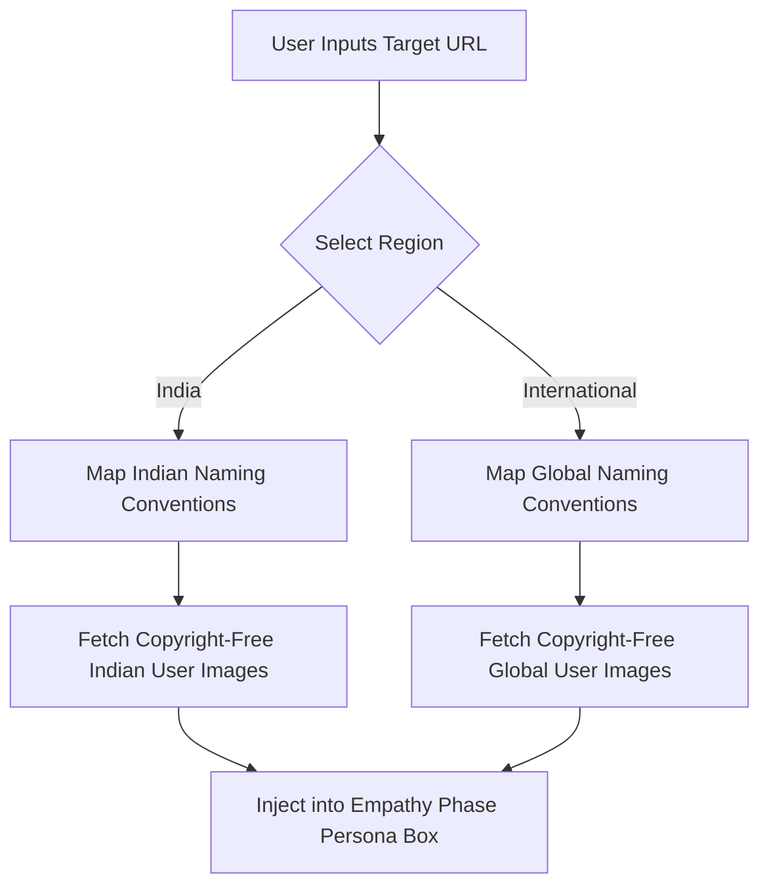

# Product Requirement Document (PRD)

## 📌 Document Information
*   **Title**: Case Study Builder - Product Requirement Document (PRD)
*   **Author**: Lead Product Manager (LPM)
*   **Status**: APPROVED & ACTIVE
*   **Target Release**: v1.0.0
*   **Global Mandate**: Absolute preservation of the **RoundMart High-Fidelity Skeleton** layout and mobile responsiveness. Zero layout breakages.

---

## 📖 1. Product Vision & Value Proposition
Visual UI designers are exceptional at crafting stunning screens, but often struggle with the rigorous, time-consuming task of drafting deep, research-backed UX case studies. 
The **Case Study Builder** solves this by automating the strategic narrative. By analyzing user-supplied target application URLs, the platform's AI/agentic pipeline extracts visual patterns, synthesizes comprehensive heuristic audits, generates region-aware personas, and maps the resulting data into an **immutable, ultra-premium visual skeleton**.

---

## 🏗️ 2. The Immutable Skeleton Mandate
The structural layout, visual components, CSS grid patterns, and typography hierarchies from the verified **RoundMart Showcase** represent the permanent skeleton. 
*   **Structural Integrity**: No developer or designer may remove, rename, or collapse any structural sections or information architecture (IA) containers.
*   **Data Injection Only**: The agentic pipeline must strictly inject dynamically gathered data into the predefined skeleton containers using CSS selectors and Jinja2 mapping keys.
*   **Responsiveness Guardrail**: The output page must remain perfectly mobile-responsive across all viewports. No hardcoded width overflows or styling damage is permitted.

---

## 📝 3. Data Field Character & Word Count Matrix
To prevent layout breaking, line clipping, text overlapping, or visual clutter, the dynamic content generator must strictly adhere to the following character/word count specifications:

| Section / Box | HTML Element ID / Class | Target Word Count | Max Character Count | Failure Behavior |
| :--- | :--- | :--- | :--- | :--- |
| **Main Hero Title** | `.hero-title` | 6 - 8 words | 60 chars | Truncate & append `...` |
| **Main Hero Subtitle** | `.hero-subtitle` | 12 - 16 words | 120 chars | Truncate & append `...` |
| **Hero Metadata: Role** | `#meta-role` | 2 - 3 words | 25 chars | Enforce strict wrap |
| **Hero Metadata: Duration** | `#meta-duration` | 2 - 3 words | 20 chars | Enforce strict wrap |
| **Hero Metadata: Platform** | `#meta-platform` | 1 - 2 words | 15 chars | Enforce strict wrap |
| **Executive Overview Title** | `.exec-title` | 4 - 6 words | 40 chars | Hard limit |
| **Executive Overview Body** | `.exec-body` | 100 - 120 words | 750 chars | Truncate & append `...` |
| **Problem Space Intro** | `.prob-intro` | 20 - 30 words | 200 chars | Soft limit |
| **Problem Statement Card Title**| `.prob-card-title` | 2 - 4 words | 30 chars | Hard limit |
| **Problem Statement Card Desc** | `.prob-card-desc` | 20 - 25 words | 180 chars | Truncate to 180 |
| **Affinity Wall Theme Title** | `.affinity-title` | 2 - 3 words | 25 chars | Hard limit |
| **Affinity Wall Theme Desc** | `.affinity-desc` | 15 - 20 words | 140 chars | Truncate to 140 |
| **Persona Quote** | `.persona-quote` | 12 - 16 words | 120 chars | Wrap in italic quotes |
| **Persona Pain Point Items** | `.persona-pains` | 6 - 8 words per item | 50 chars per item | Hard limit |

---

## 🌐 4. Intake Configuration & Metadata Specifications

### 4.1 Platform Specification
During the Step 1 configuration intake, the user must specify the target platform. The system will store this in the metadata and inject it into the hero details:
*   **Web Application**: Triggers horizontal minimal browser mockups.
*   **Mobile Application**: Triggers vertical smartphone mockups (e.g., iPhone 15 Pro frame).
*   **Hybrid**: Renders a fanned showcase containing both Web and Mobile device frames.

### 4.2 Region-Aware Ingestion Pipeline (India vs. International)
The intake configuration features a **Region Selection** dropdown: `[India | International]`. Based on this selection, the AI Persona Ingestion pipeline must dynamically load assets matching the regional target:

*   **India Target**: Personas must utilize names (e.g., *Arjun Sharma*, *Priya Patel*) and load high-quality, **completely copyright-free / royalty-free Indian user portraits** from a local verified assets directory or approved royalty-free public domain APIs.
*   **International Target**: Personas must utilize globally aligned names (e.g., *Sarah Jenkins*, *Marcus Vance*) and load high-quality, **completely copyright-free / royalty-free international user portraits**.

---

## 🎨 5. Brand Identity & Accessibility Mandate (WCAG 2.1 AA)

### 5.1 Predefined Brand Identities
The intake process supports four distinct brand identities. Choosing an identity dynamically overrides the CSS variable block (`:root`) of the final skeleton page:
1.  **Boardroom Obsidian (Default)**: Deep charcoal blacks, muted golds, glassmorphic dark grey card frames.
2.  **Nordic Minimalist**: Crisp ice-white backgrounds, slate grey borders, deep charcoal text.
3.  **Holographic Modern**: Midnight blue gradients, neon cyan accents, translucent glowing cards.
4.  **Organic Professional**: Soft warm cream backgrounds, forest green accents, dark olive text.

### 5.2 Strict Accessibility Contrast Rule
To ensure maximum readability, text discoverability, and clean professional presentation, the dynamic contrast ratio between the foreground text/UI triggers and the background elements must strictly meet or exceed **WCAG 2.1 AA standards**:
*   **Standard Text**: Must maintain a minimum contrast ratio of **4.5:1** against the background.
*   **Large Text (18pt / bold 14pt and above)**: Must maintain a minimum contrast ratio of **3:1**.
*   **Global Variables Guardrail**: The developer must map the CSS variables system such that no color combination violating these ratios can be injected. 

$$\text{Contrast Ratio} = \frac{L_1 + 0.05}{L_2 + 0.05} \ge 4.5$$
*(where $L_1$ is the relative luminance of the lighter color, and $L_2$ is the relative luminance of the darker color).*

---

## 📸 6. Agentic Screenshot Ingestion & Dynamic Wireframing

### 6.1 Multi-Viewport Image Scraper
The agentic pipeline features an automated Playwright crawler that visits the target URL provided by the user:
*   **Viewport Capture**: Automatically takes high-definition screenshots at multiple viewport breakpoints:
    *   *Desktop Web*: `1440x900`
    *   *Mobile Responsive*: `375x812` (iPhone X/11/12 scale)
*   **Dynamic Wrapping**: The captured images must be dynamically injected into the matching high-fidelity device frames (browser wrapper for Web, phone container for Mobile) designed by the UI/UX team.

### 6.2 Minimalist Wireframe Ingestion
The system must generate or reference a minimalist, low-fidelity wireframe showcase for at least one core page of the target platform (Web or Mobile depending on platform spec). 
*   **Styling**: Use thin slate grey lines, placeholder grey image blocks (X-boxes), and clean layout wireframe grids to elegantly demonstrate the mid-fidelity structure.

---

## 🛠️ 7. Role-Specific Technical Instructions

### 👨‍💻 Full-Stack Developer Lead (FSD)
1.  **Zero-Compression CSS**: Implement absolute layout constraints. Ensure `flex-wrap`, `min-width`, and relative units are calibrated so that loading long data sets never compresses layout boxes or distorts visual symmetry.
2.  **Variable Engine**: Map all brand-specific properties strictly to the CSS variables:
    *   `--bg-primary`
    *   `--text-primary`
    *   `--text-secondary`
    *   `--accent`
    *   `--border-medium`
3.  **Truncation Helpers**: Implement automated Python/Jinja2 filter overrides or CSS properties (`text-overflow: ellipsis; white-space: nowrap; overflow: hidden`) to enforce the character limit limits.

### 🎨 Lead UI/UX Designer
1.  **Contrast Table Audit**: Map every brand theme combination through a contrast checker tool to certify compliance with the **4.5:1 ratio**.
2.  **Copyright-Free Library**: Establish the local asset path for royalty-free persona photos, categorized strictly by region `(India / International)`.

### 🧪 Lead Tester
1.  **Character Limit Flood Test**: Input extremely long strings of text (e.g., 2000 characters) into all data fields and verify that the layout handles the overflow gracefully without shifting components.
2.  **Accessibility Verification**: Run automated lighthouse/contrast accessibility sweeps on the output URLs to ensure zero violations of the WCAG 4.5:1 ratio.
